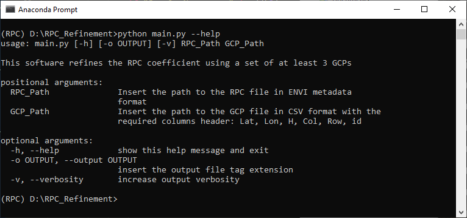
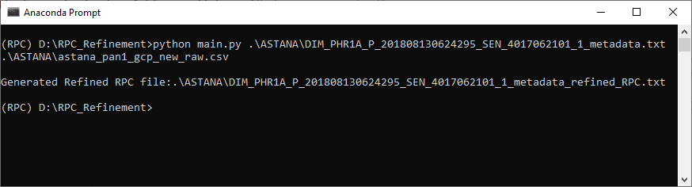
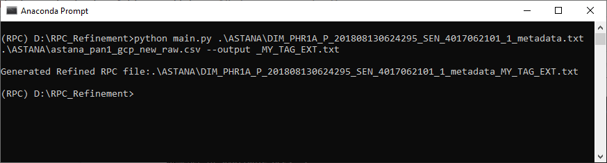
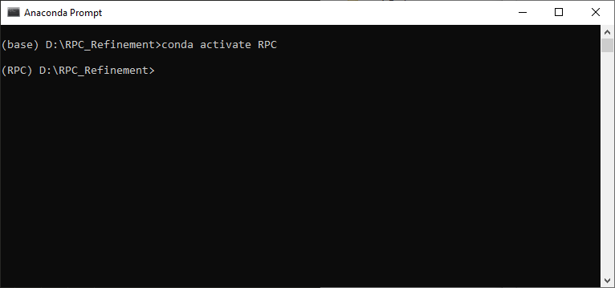
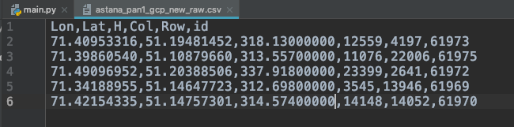
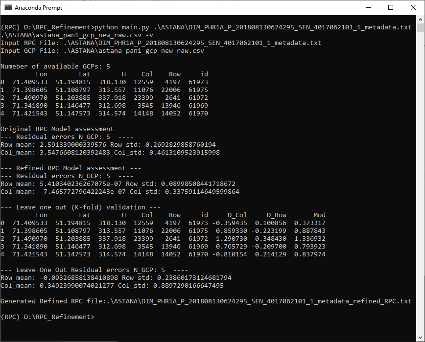

## RPC Refiner 

### Installation using conda (cross-platform):

1. Install conda (if Python 3.7 is not available in your machine) following the instructions [https://docs.conda.io/projects/conda/en/latest/user-guide/install/](https://docs.conda.io/projects/conda/en/latest/user-guide/install/) 
2. Unzip the RPC Refiner in a new directory (PATH/RPC_Refiner/)
3. Open the Anaconda Prompt and navigate to this directory
4. Create a new python virtual environment named “RPC” running the following command in the prompt:

    conda create --name RPC python=3.7

5. Activate the new environment RPC running the following command 

    	conda activate RPC

    Check that the env is active looking at the reported name inside the bracket 

6. Install all the required packages using the following command 

		pip **install** -r requirements.txt

7. The installation is complete and you can test the software running the command and check the help information

		**python** main.**py** --**help**

**Note:** if you have already installed in your machine python3.7 and pip3 (without conda) and you don’t want to use conda follow this instruction to create the new env. 

[https://packaging.python.org/guides/installing-using-pip-and-virtual-environments/](https://packaging.python.org/guides/installing-using-pip-and-virtual-environments/)

Continue installing the required packages from step 6

### How to use RPC Refiner:

Input file:

1. Satellite image RPC in ENVI Metadata format 
2. CSV file with the list of available GCPs (at least 3 GCPs); the CSV file must have a header line like in the following example

To run the RPC Refiner use the command line 

	python main.py PATH_RPC PATH_GCP

Example 1: results without verbosity 

Example 2: results with verbosity option

Example 3: results with output file tag option

